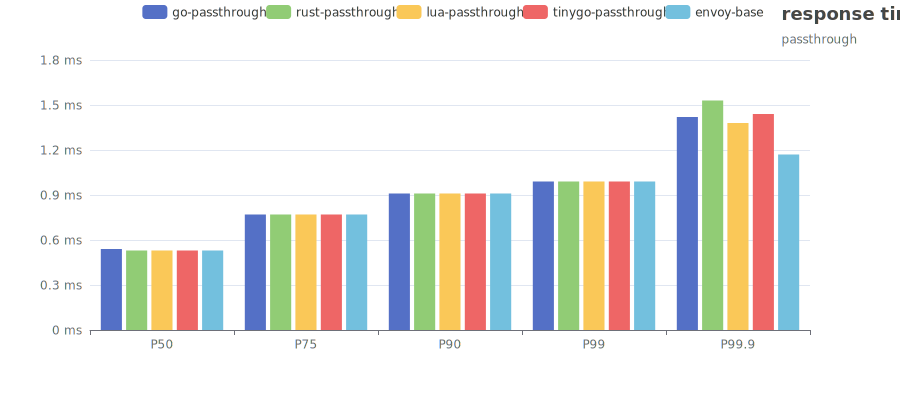

[//]: # (this is generated by template, don't edit)

# envoy-filter-benchmark

envoy的 filter 目前有 3 种类型，5 种实现方式，本项目对 4 种实现方式进行了压力测试，以方便比较和选择合适的实现方式

3种类型为：

- 基于 lua 语言的 lua 引擎
- 基于 go 语言的 go 执行引擎
- 基于多种语言的 wasm v8 引擎

4 种实现方式为：

- 使用 lua 语言实现
- 使用 go 语言实现
- 使用 tinygo 实现的 wasm
- 使用 rust 实现的 wasm
- ~~使用 c++ 实现的 wasm~~ (不会 c++)

其中 go 语言的 go 执行引擎目前还在测试阶段，只有**contrib**版本的 envoy 才有此功能

## 本地运行

本地运行只依赖 docker 和 docker compose 环境，只需要在根目录下运行./bench.sh 即可
虽然运行环境不同，如 CPU，内存大小等每个人的环境不尽相同，但是本压测也只是横向对比，
更多的是参考相同环境下的各种实现之间的差异，所以环境不同不影响压测执行

## 执行结果

压测脚本会对不同场景，不同实现各执行一次，会使用 fortio 进行压测，压测结果文件分别放在 report-passthrough 和 report-basic-auth 目录下
然后执行 report-into-readme 代码进行分析生成柱状图，使用模版生成此 README 文件

### passthrough 场景

此场景只是引入对应实现机制，而什么都不做，对比 envoy 基准测试

结果如下：

| 实现方式       | RT-Min | RT-Avg | RT-Max | RT-P50 | RT-P75 | RT-P90 | RT-P99 | RT-P99.9 | QPS |
|------------|--------|--------|--------|--------|--------|--------|--------|----------|-----|
| go-passthrough| 0.0762 ms| 0.2466 ms| 14.8944 ms| 0.5387 ms| 0.7700 ms| 0.9088 ms| 0.9921 ms| 1.4151 ms| 40515 qps|
| rust-passthrough| 0.0644 ms| 0.2284 ms| 14.0079 ms| 0.5330 ms| 0.7673 ms| 0.9079 ms| 0.9922 ms| 1.5325 ms| 43742 qps|
| lua-passthrough| 0.0646 ms| 0.2421 ms| 13.2858 ms| 0.5330 ms| 0.7671 ms| 0.9077 ms| 0.9920 ms| 1.3817 ms| 41265 qps|
| tinygo-passthrough| 0.0647 ms| 0.2285 ms| 13.6203 ms| 0.5330 ms| 0.7672 ms| 0.9077 ms| 0.9920 ms| 1.4436 ms| 43722 qps|
| envoy-base| 0.0595 ms| 0.2166 ms| 14.6340 ms| 0.5303 ms| 0.7657 ms| 0.9069 ms| 0.9917 ms| 1.1660 ms| 46130 qps|

P50-P99.9 的柱状图

### basic-auth 场景

此场景是验证 http 的 basic-auth 功能，如果 token 验证正确则返回结果，否则返回 403

结果如下：

| 实现方式       | RT-Min | RT-Avg | RT-Max | RT-P50 | RT-P75 | RT-P90 | RT-P99 | RT-P99.9 | QPS |
|------------|--------|--------|--------|--------|--------|--------|--------|----------|-----|
  | tinygo-basic-auth| 0.0691 ms| 0.2689 ms| 2267.2373 ms| 0.5353 ms| 0.7684 ms| 0.9083 ms| 0.9922 ms| 1.6238 ms| 37159 qps|
  | go-basic-auth| 0.0710 ms| 0.2508 ms| 9.9445 ms| 0.5366 ms| 0.7693 ms| 0.9090 ms| 0.9928 ms| 1.7371 ms| 39834 qps|
  | rust-basic-auth| 0.0673 ms| 0.2531 ms| 7.0731 ms| 0.5344 ms| 0.7679 ms| 0.9080 ms| 0.9921 ms| 1.4461 ms| 39479 qps|
  | lua-basic-auth| 0.0848 ms| 0.3059 ms| 9.7644 ms| 0.5434 ms| 0.7727 ms| 0.9103 ms| 0.9928 ms| 1.6814 ms| 32666 qps|

P50-P99.9 的柱状图

## 结论

1. 不管是何种实现方式，p50-p99 的响应都差别不大
2. 但是 qps 表现最好的是 rust 实现方式
3. tinygo 不推荐使用，因为 Max 响应时间太长，导致 qps 垫底
4. go 语言的 go 执行引擎目前还在测试阶段，只有**contrib**版本的 envoy 才有此功能，可能需要定制 istio 的 envoy image，才能运行
5. lua 的 qps 也基本倒数，符合无 JIT 优化的表现
6. rust 的稳定性和 qps 是最好的，也是最为推荐的