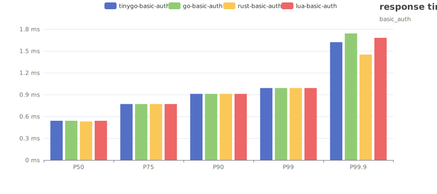

[//]: # (this is generated by template, don't edit)

# envoy-filter-benchmark

envoy的 filter 目前有 3 种类型，4 种实习方式，本项目对 4 种实现方式进行了压力测试，以方便比较和选择合适的实现方式

3种类型为：

- 基于 lua 语言的 lua 引擎
- 基于 go 语言的 go 执行引擎
- 基于多种语言的 wasm v8 引擎

4 种实现方式为：

- 使用 lua 语言实现
- 使用 go 语言实现
- 使用 tinygo 实现的 wasm
- 使用 rust 实现的 wasm

其中 go 语言的 go 执行引擎目前还在测试阶段，只有**contrib**版本的 envoy 才有此功能

## 本地运行

本地运行只依赖 docker 和 docker compose 环境，只需要在根目录下运行./bench.sh 即可
虽然运行环境不同，如 CPU，内存大小等每个人的环境不尽相同，但是本压测也只是横向对比，
更多的是参考相同环境下的各种实现之间的差异，所以环境不同不影响压测执行

## 执行结果

压测脚本会对不同场景，不同实现各执行一次，会使用 fortio 进行压测，压测结果文件分别放在 report-passthrough 和 report-basic-auth 目录下
然后执行 report-to-svg 代码进行分析生成柱状图，使用模版生成此 README 文件

### passthrough 场景

此场景只是引入对应实现机制，而什么都不做，对比 envoy 基准测试

结果如下：

| 实现方式       | RT-Min | RT-Avg | RT-Max | RT-P50 | RT-P75 | RT-P90 | RT-P99 | RT-P99.9 | QPS |
|------------|--------|--------|--------|--------|--------|--------|--------|----------|-----|
| rust-passthrough| 0.0620 ms| 0.2249 ms| 10.7349 ms| 0.5316 ms| 0.7665 ms| 0.9074 ms| 0.9919 ms| 1.3712 ms| 44429 qps|
| tinygo-passthrough| 0.0642 ms| 0.2262 ms| 10.0355 ms| 0.5327 ms| 0.7670 ms| 0.9075 ms| 0.9918 ms| 1.3008 ms| 44179 qps|
| lua-passthrough| 0.0666 ms| 0.2408 ms| 10.8287 ms| 0.5339 ms| 0.7676 ms| 0.9078 ms| 0.9919 ms| 1.3162 ms| 41491 qps|
| envoy-base| 0.0580 ms| 0.2158 ms| 13.2023 ms| 0.5296 ms| 0.7653 ms| 0.9068 ms| 0.9916 ms| 1.1719 ms| 46296 qps|
| go-passthrough| 0.0695 ms| 0.2452 ms| 15.0272 ms| 0.5354 ms| 0.7684 ms| 0.9082 ms| 0.9920 ms| 1.4171 ms| 40754 qps|

P50-P99.9 的柱状图

### basic-auth 场景

此场景是验证 http 的 basic-auth 功能，如果 token 验证正确则返回结果，否则返回 403

结果如下：

| 实现方式       | RT-Min | RT-Avg | RT-Max | RT-P50 | RT-P75 | RT-P90 | RT-P99 | RT-P99.9 | QPS |
|------------|--------|--------|--------|--------|--------|--------|--------|----------|-----|
  | lua-basic-auth| 0.0837 ms| 0.2799 ms| 11.1986 ms| 0.5427 ms| 0.7721 ms| 0.9098 ms| 0.9925 ms| 1.5955 ms| 35700 qps|
  | go-basic-auth| 0.0664 ms| 0.2559 ms| 15.1697 ms| 0.5349 ms| 0.7692 ms| 0.9097 ms| 0.9940 ms| 1.9459 ms| 39051 qps|
  | rust-basic-auth| 0.0652 ms| 0.2341 ms| 11.2589 ms| 0.5332 ms| 0.7672 ms| 0.9076 ms| 0.9918 ms| 1.2693 ms| 42684 qps|
  | tinygo-basic-auth| 0.0660 ms| 0.2791 ms| 6002.8742 ms| 0.5338 ms| 0.7678 ms| 0.9081 ms| 0.9923 ms| 1.6539 ms| 34137 qps|

P50-P99.9 的柱状图

